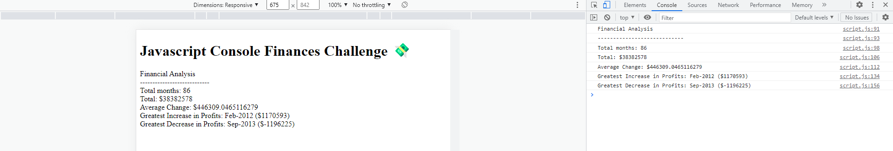

# Javascript Console Finances Challenge

## Description
This application presents a financial analysis based on real-life financial records for an anonymous company by the use of Vanilla Javascript.
The analysis details the following :
* The total number of months included in the dataset.

* The net total amount of Profit/Losses over the entire period.

* The average of the **changes** in Profit/Losses over the entire period.
  * The total change in profits are from month to month and then find the average.
  * (`Total/Number of months`)

* The greatest increase in profits (date and amount) over the entire period.

* The greatest decrease in losses (date and amount) over the entire period.

## Application Display

## Installation
Not applicable

## Usage
Navigate to the application via the following hyperlink: 
https://crystalpharma.github.io/Console-Finances/

Then, right click in the browser and select the inspect option to bring up the developer tool

Click on Console to view the content as shown on the <b>Application display

## Credits
- Edx Trilogy Course 
- mdn web doc_
- Udemy

## License
MIT License

## Badges

